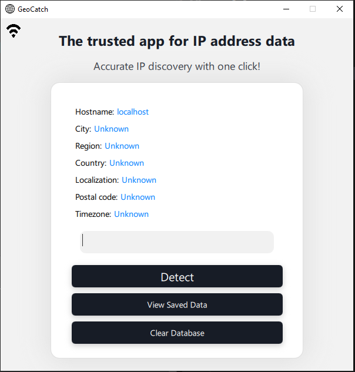
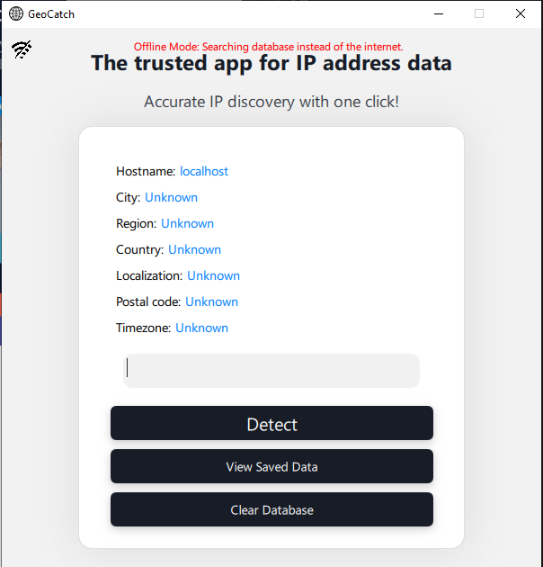

# GeoCatch Application

GeoCatch is a cross-platform application for discovering geolocation details of IP addresses and URLs. It uses both online APIs and offline database search to provide detailed information. The app supports **Windows** and **MacOS** platforms.

Please don't mind the Qt QML files, as it is my first time designing a desktop application with this framework and embedded databases.

I had lots of fun exploring the Qt framework over the past couple of days, and I hope you will enjoy using GeoCatch as much as I enjoyed building it!

---

## 🚀 Features

- [x] **Validate IP Addresses**: Check if the input is a valid IP address.
- [x] **Validate URLs**: Normalize and verify the validity of a given URL.
- [x] **Geolocation Retrieval**: Get geolocation information (city, region, country, etc.) for valid IPs/URLs using online APIs.
- [x] **Offline Mode**: Search and retrieve data from the local database when offline.
- [x] **Database Management**:
    - [x] Save unique addresses and related data.
    - [x] View stored geolocation data.
    - [x] Clear the database when needed.
- [x] **Cross-Platform**:
    - [x] Windows `.exe` build.
    - [x] macOS `.app` build.
- [x] **User-Friendly Interface**: Simple and intuitive design.
- [x] **Easter Egg and Animations**: Includes fun elements and visual indicators for a better user experience.

---

## 📂 Directories and Files

- **Windows Executable**: `app/Windows/appGeoCatch.exe`
- **MacOS Executable**: `app/MacOS/GeoCatch.app`

Both executables include all necessary dependencies for standalone execution. **Note:** Run the app strictly from the directory it resides in.

---

## 📜 Usage Instructions

### Run the Application

1. **Windows**:
   - Navigate to `app/Windows/` and unpack the zipped project.
   - Double-click `appGeoCatch.exe` to launch the application.

2. **MacOS**:
   - Navigate to `app/MacOS/` and unpack the zipped project.
   - Double-click `GeoCatch.app` to launch the application.

Upon successful launch, the app will display a user-friendly UI. If connected to the internet, the app should look like this:

When offline, the app automatically switches to offline mode, allowing you to search saved IP addresses in the database:

---

## ⚙️ Dependencies

- **Qt 6.6**: For GUI and networking functionality.
- **SQLite**: For local database storage.
- **CMake**: For project configuration and builds.

---
